# FasterRCNN和yolov5训练飞机目标识别的项目


目标检测算法主要包括：两类two-stage和one-stage

一类是two-stage，two-stage检测算法将检测问题划分为两个阶段，首先产生候选区域（region proposals），然后对候选区域分类（一般还需要对位置精修），这一类的典型代表是R-CNN, Fast R-CNN, Faster R-CNN，Mask R-CNN家族。他们识别错误率低，漏识别率也较低，但速度较慢，不能满足实时检测场景。

另一类方式称为one-stage检测算法，其不需要region proposal阶段，直接产生物体的类别概率和位置坐标值，经过单次检测即可直接得到最终的检测结果，因此有着更快的检测速度，比较典型的算法如YOLOv5，SSD，RetinaNet等。


 FasterRCNN和yolov5可以说是目前最先进的两类算法，本次将使用FasterRCNN和yolov5训练飞机目标识别的项目


数据集来源：从COCO2017 val的图片中随机抽取99张包含飞机类别目标的图片来构成mini-airplane数据集，抽取的代码位于 

COCO2017 val 下载地址：https://github.com/ultralytics/yolov5/releases/download/v1.0/coco2017val.zip


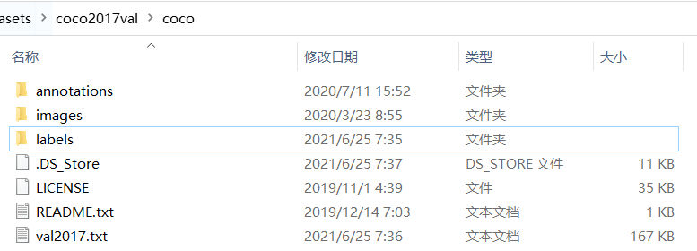


generate_mini_airplane.py  从COCO2017 val的图片中随机抽取99张包含飞机类别目标的图片来构成mini-airplane数据集


## FasterRCNN

FasterRCNN相关教程：https://work.datafountain.cn/forum?id=4791&type=1&source=2

文件夹中FasterRCNN
- coco 官方的文件
- dataset torch读取数据集
- model FasterRCNN 预训练模型 修改输出
- data_split  生成训练集和测试集


```python
(base) ng@ng-Z390:/home/lrs/demo/fastrcnn$ python ./coco/coco_eval.py ../results/val_results.json --ann ../mini_airplane/annotations/val.json
```

fastrcnn训练测试结果

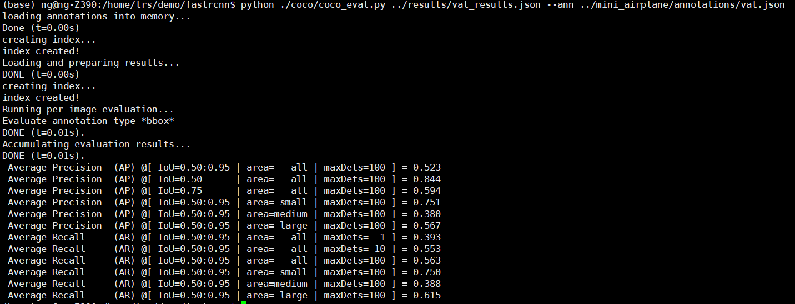


results/val_vis中存放了fastrcnn模型测试结果

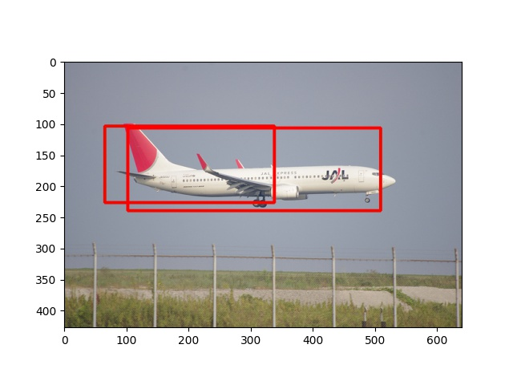
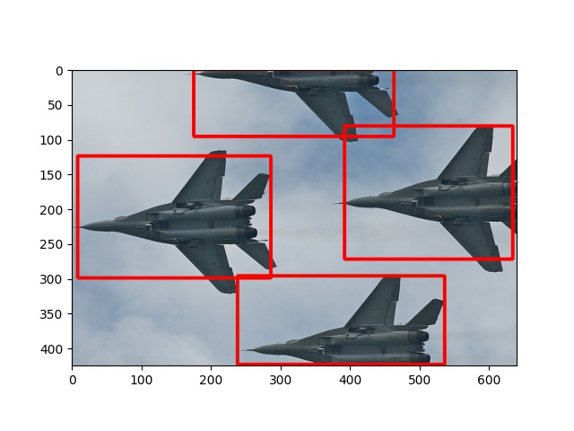
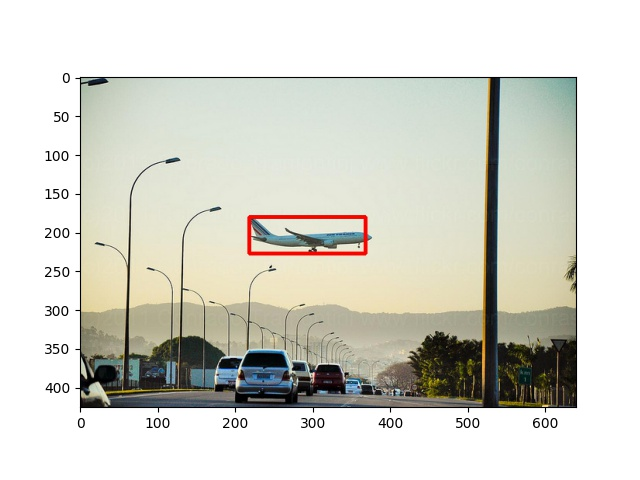
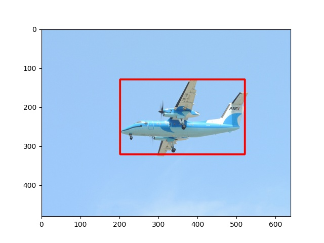
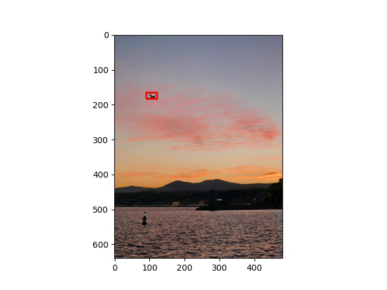
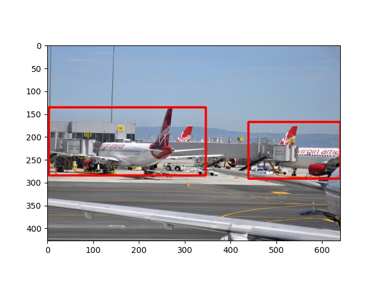
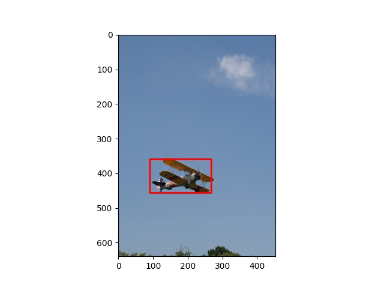


模型保存到models文件夹中。


## yolo


yolo相关教程：https://work.datafountain.cn/forum?id=89&type=2&source=1

上面教程基于yolov3，可以参考github上的v5教程。对数据进行相关的处理


由于coco数据存在相关的yolo数据，只需要划分训练集和测试集即可，脚本是yolo_split_data.py，


mini-airplane.yaml

```yaml
train: ../mini_airplane/ImageSets/Main/train.txt  
val: ../mini_airplane/ImageSets/Main/val.txt
test: ../mini_airplane/ImageSets/Main/test.txt  


# number of classes
nc: 1

# class names
names: ['airplane']
```


对应模型的yaml文件将80设置为1。

在yolo文件夹中，执行各yolov5模型训练代码

```python
python train.py --img 610 --batch 32 --epochs 100 --data data/mini-airplane.yaml --cfg models/yolov5s.yaml  --weights weights/yolov5s.pt --name=yolov5s
```
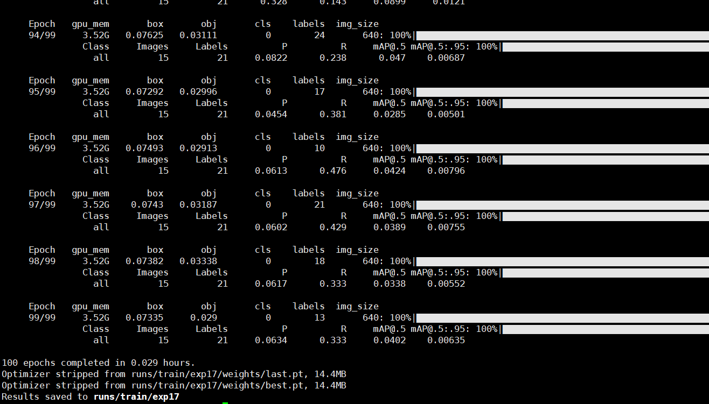

yolo5s的map非常出乎我的意料，一直保持0.01不动

```
python train.py --img 610 --batch 16 --epochs 100 --data data/mini-airplane.yaml --cfg models/yolov5m.yaml  --weights weights/yolov5m.pt --name=yolov5m
```


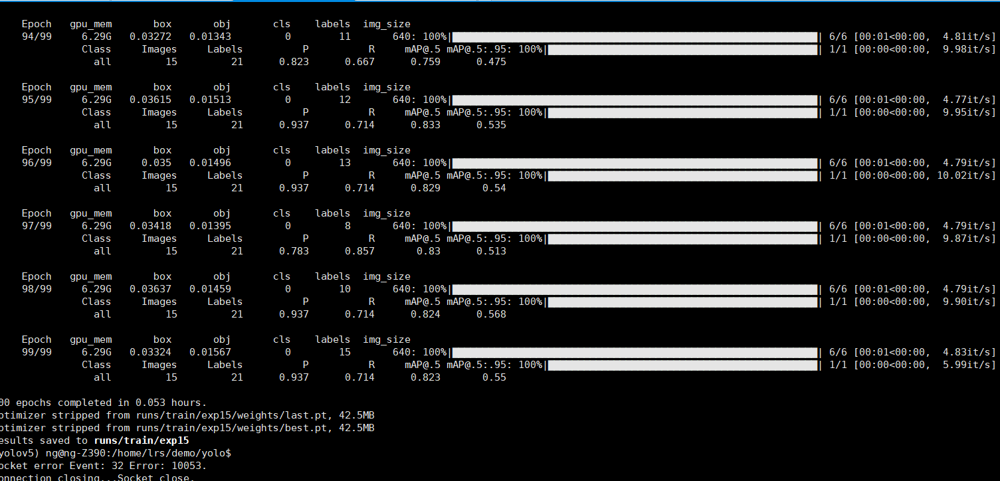

yolo5m的map0.5=0.823


```python
 python train.py --img 610 --batch 8 --epochs 100 --data data/mini-airplane.yaml --cfg models/yolov5l.yaml  --weights weights/yolov5l.pt --name=yolo5l
```

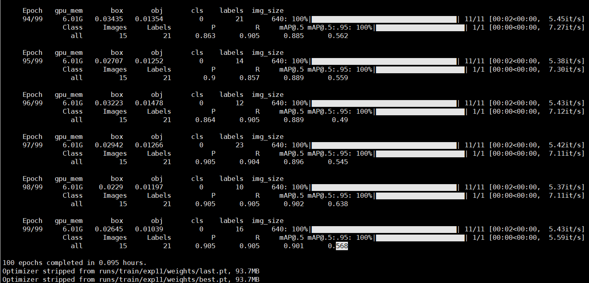

yolo5l的map0.5=0.9


```python
 python train.py --img 610 --batch 8 --epochs 100 --data data/mini-airplane.yaml --cfg models/yolov5x.yaml  --weights weights/yolov5x.pt --name=yolov5x
```

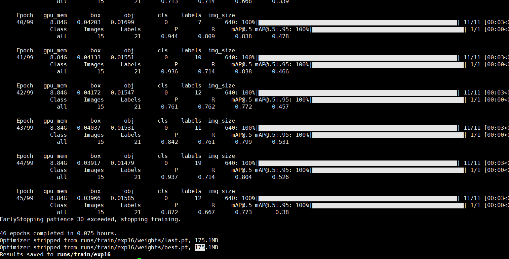

yolo5x的map0.5=0.78

下面的测试使用yolo5l 90精确度的模型：测试并保存对应的--save-txt

```python
python detect.py --weights runs/train/yolo5l/weights/best.pt --img 610 --conf 0.4 --source ../mini_airplane/images --save-txt
```

下面是yolo5l模型测试结果

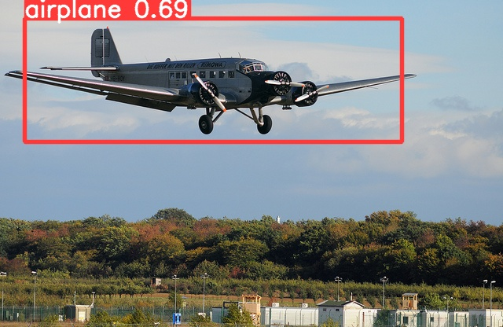
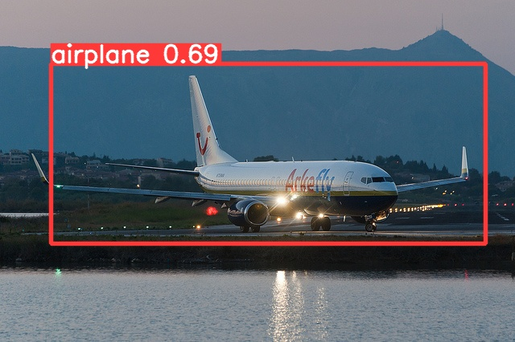
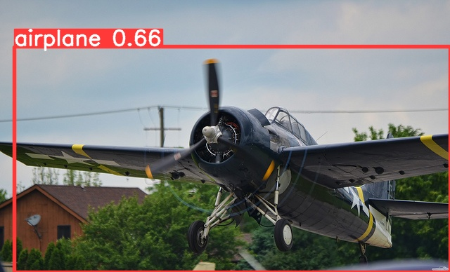
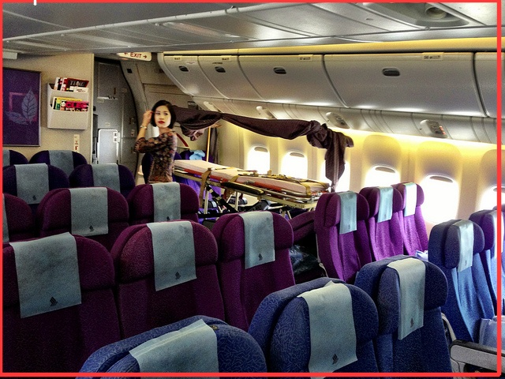
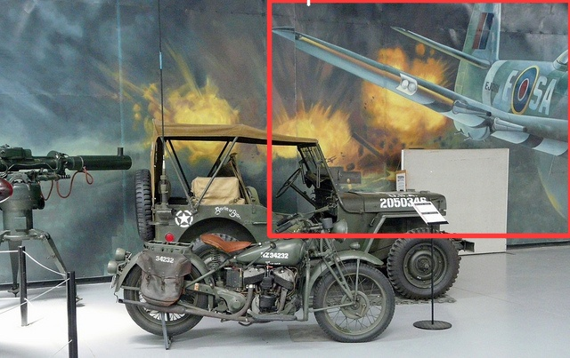

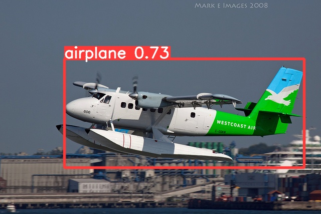
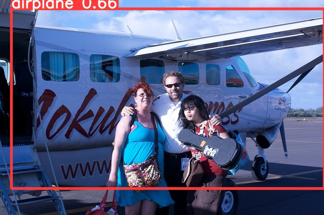
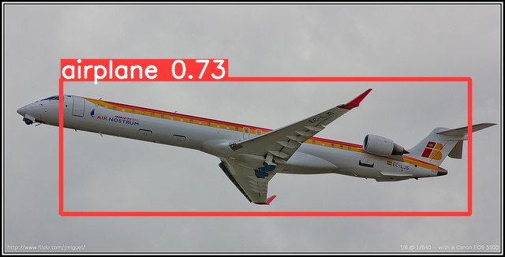
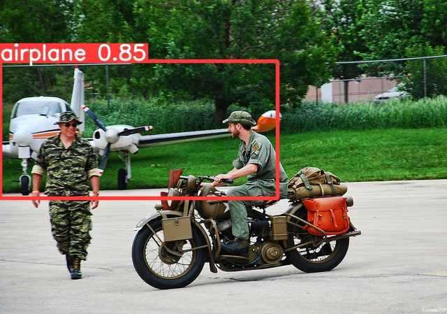
